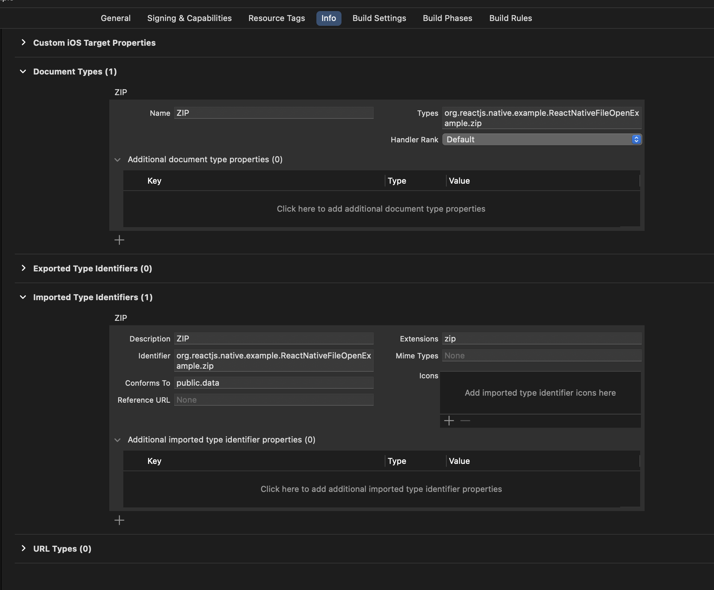

# @ankipro/react-native-file-open

Library empowers to seamlessly detect and handle external file openings on iOS. You can allowing your app to respond when users attempt to open files from other apps or external sources.

Made with 💙 by [Anki Pro](https://ankipro.net/) team

## Installation

```sh
yarn add @ankipro/react-native-file-open
```

```sh
npx pod-install
```

Sorry but, you need to modify your `ios/AppDelegate.m`.
At the top of the file, import the RNFileOpen right before '@implementation AppDelegate':

```C#
@import RNFileOpen;
```
Within your existing didFinishLaunchingWithOptions method, add the following method:

```C#
- (BOOL)application:(UIApplication *)application didFinishLaunchingWithOptions:(NSDictionary *)launchOptions {

  // Add me --- \/
  NSURL *_Nullable launchURL = [launchOptions valueForKey:UIApplicationLaunchOptionsURLKey];
  if (launchURL) {
    [[FileOpeningModule sharedInstance] markFileOpened:launchURL];
  }
  // Add me --- /\

  return [super application:application didFinishLaunchingWithOptions:launchOptions];
}
```
At the end of the file add the following:
```C#
// Add me --- \/
- (BOOL)application:(UIApplication *)application
            openURL:(NSURL *)url
            options:(nonnull NSDictionary<UIApplicationOpenURLOptionsKey, id> *)options
{
  [[FileOpeningModule sharedInstance] markFileOpened:url];
  return YES;
}
// Add me --- /\

@end
```

If you want the app to appear in suggestions when you open certain files on your device, you need to add the desired extensions in the project info.

For example adding `.zip` extension looks like:




## Basic usage

```ts
import FileOpening from '@ankipro/react-native-file-open';

// ...

 useEffect(() => {
    const onFileOpened = (uri: string) => {
      console.log('Opened file: ', uri);
    };

    FileOpening.getOpenedFileURL().then(onFileOpened).catch(() => {});

    const subscription = FileOpening.addListener((data) => {
      onFileOpened(data.url);
    });

    return () => {
      subscription.remove();
    };
  }, []);
```

For more information see [example](./example/src/App.tsx).

## Contributing

See the [contributing guide](CONTRIBUTING.md) to learn how to contribute to the repository and the development workflow.

## License

MIT

---

Made with [create-react-native-library](https://github.com/callstack/react-native-builder-bob)
